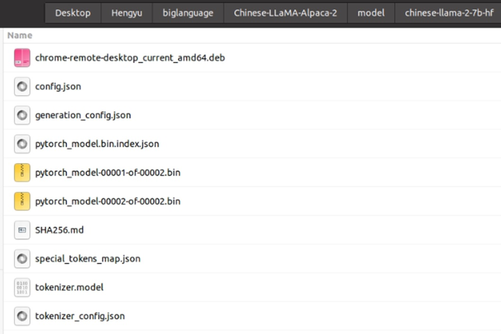
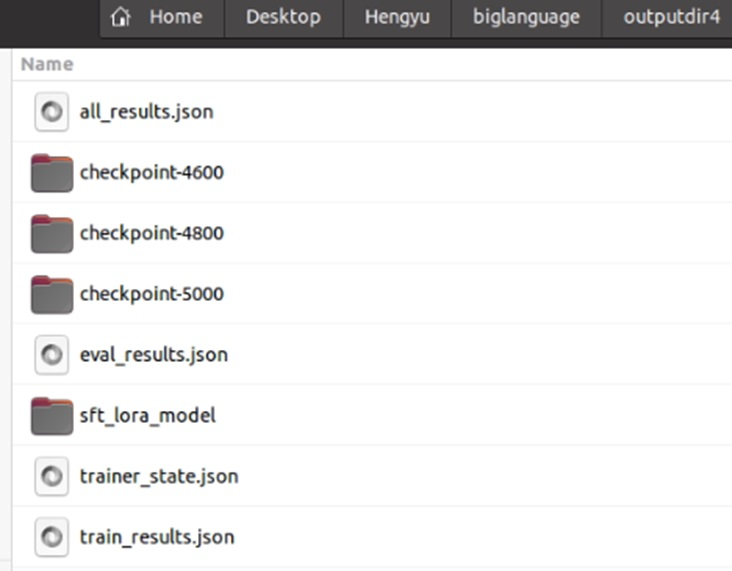
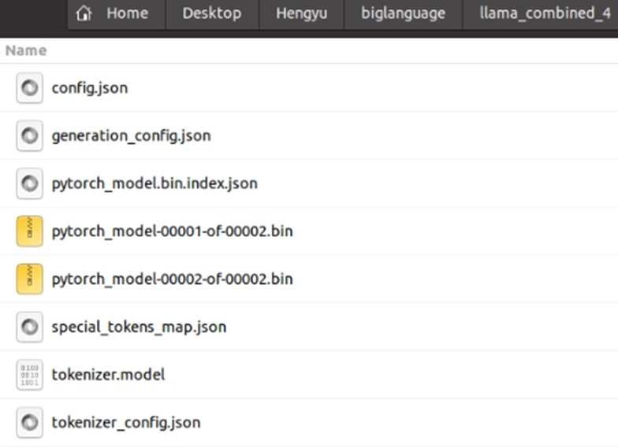
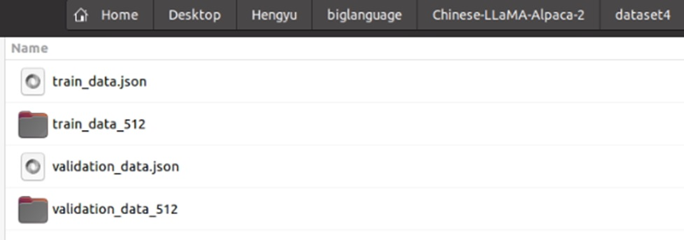
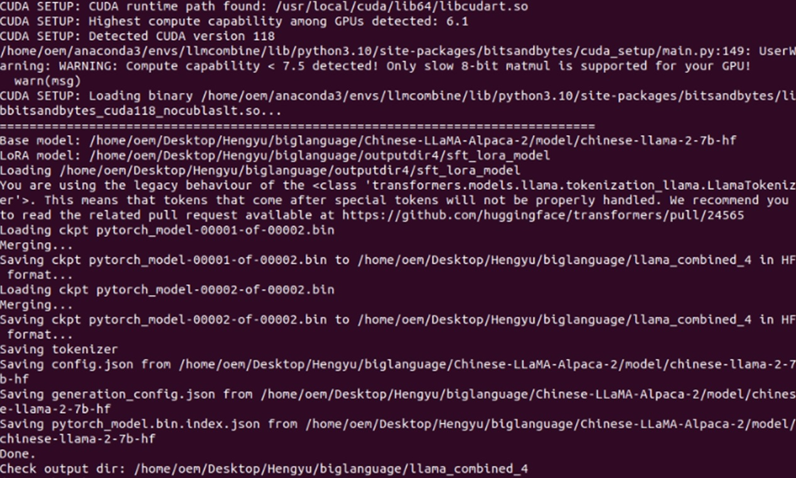
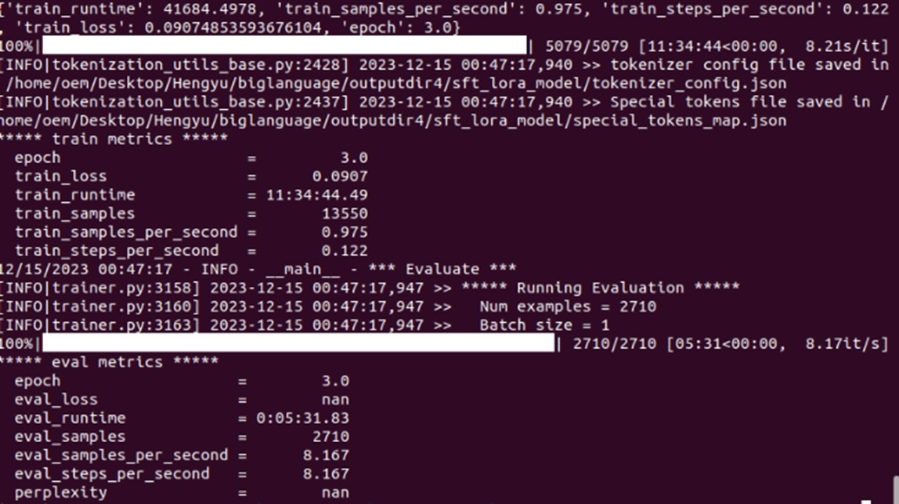
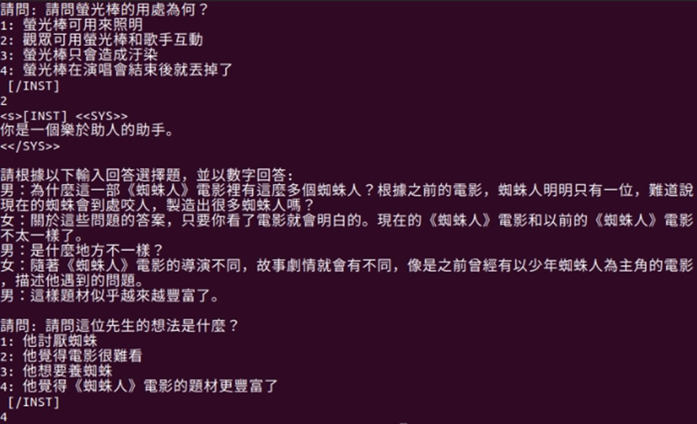

# NYCU_Machine Learning 2023-Trad. Chinese Reading Comprehension Test for LLMs
### Trad. Chinese Reading Comprehension Tesst for LLMs
## 312605015詹恆瑜
## Author
|Student ID|GitHub Account|Name|Email| 
| :--:    | :--:   |:--:  | :--: |
|312605015|312605015|詹恆瑜|happydog101155@gmail.com| 

---
>系統環境: linux  
>Anaconda執行用環境: environment.yaml
##
>執行的程式碼:
>>1. tojson.py
>>2. tojsonai1000.py
>>3. run_sft_new.sh
>>4. merge_llama2_with_chinese_lora_low_mem.py
>>5. mygen.py
##
>輸出的檔案:
>>1. sft_lora_model  
>>2. AI1000.json
>>3. validation_data.json
>>4. train_data.json
>>5. answer4.csv
##
>其他資料(執行作業照片、介紹):
>>1. README.md  
>>2. train.jpg 
>>3. combined_fold.jpg
>>4. combined.jpg
>>5. dataset.jpg 
>>6. model.jpg
>>7. outputdir.jpg
>>8. testing.jpg
##

1.作法說明
===
主要的幾次調整的參數:
|  | 80%train 20%val | 100%train |  100%train |   100%train |
| :--:    | :--:   |:--:   |   :--:   | :--:   |
| Epochs  |   1     |   2   |    2   |   3   |
| lora_rank |   32    | 32   |   48     |   48     | 
|lora_alpha | 64  | 64 |  64   |   64  |   64    |
|warmup_ratio |  0.03 | 0.03|   0.03  |   0.04  | 

首先我把我這次的作業分成四大部分來做介紹，第一步驟是先對資料做預處理，要把我們的訓練資料的csv檔轉為特定訓練格式的json.檔，且也要把test資料也轉為特定個式的json.檔，因為test的沒有答案且最後要輸出題號，所以格式稍微和train不同，且要放在指定的dataset路徑上，最後還要下載基本模型Chinese-LLaMA-2-7B來當作我的基座模型放在model資料夾中；第二步驟是架設好環境並執行run_sft_new.sh來進行訓練，這步必須要將環境路徑給設置好；第三步驟則是將訓練好的sft_lora_model和我的基座模型去做整合，得到我最後的訓練模型，第四步驟則是將我的test結果輸出出來，當我確認步驟都正確之後我就相所有的訓練資料丟去訓練，目的是希望訓練效果可以更好，在我好幾次的參數微小調整下，在kaggle的分數都有微小變好的跡象。

基座模型、輸出outputdir、結合後的資料夾呈現的效果和路徑如下圖，




2.程式方塊圖與寫法
===============

首先我寫了兩段程式碼tojson.py、tojsonai1000.py來將我的訓練和測試資料轉為指定json檔，主要是提取csv檔相對應的資料，然後轉變成規定的json檔，並放到指定的資料夾中準備等待訓練，要注意dataset資料夾中的json檔都會被拿來當作訓練資料。

```python
# -*- coding: utf-8 -*-
import pandas as pd
import json
from sklearn.model_selection import train_test_split

# 讀取Excel檔案
df = pd.read_excel("C:\\software\\python\\biglanguage\\AI.xlsx")

# 轉換每一行為指定的JSON格式
def convert_row_to_json(row):
    # 指令部分的固定文本
    instruction = "請根據以下輸入回答選擇題，並以數字回答:\n"
    # 將文章、問題及選項內的換行符號替換成JSON中的換行表示，並將選項編入input中
    input_text = (row['文章'].replace('\n', '\n') + "\n\n" + "請問: " + row['問題'].replace('\n', '\n') +
                  "\n1: " + str(row['選項1']).replace('\n', '\\n') +
                  "\n2: " + str(row['選項2']).replace('\n', '\\n') +
                  "\n3: " + str(row['選項3']).replace('\n', '\\n') +
                  "\n4: " + str(row['選項4']).replace('\n', '\\n') + "\n")
    # 正確答案僅包含答案數字
    output = str(row['正確答案'])
    
    # 組合成最終的JSON物件
    json_entry = {
        "instruction": instruction,
        "input": input_text,
        "output": output
    }
    
    return json_entry

# 將函數應用到每一行數據，並將結果保存在一個列表中
json_data = [convert_row_to_json(row) for index, row in df.iterrows()]

train_data, validation_data = train_test_split(json_data, test_size=0.2, random_state=42)

with open('C:\\software\\python\\biglanguage\\train_data.json', 'w', encoding='utf-8') as f:
    json.dump(train_data, f, ensure_ascii=False, indent=2)

with open('C:\\software\\python\\biglanguage\\validation_data.json', 'w', encoding='utf-8') as f:
    json.dump(validation_data, f, ensure_ascii=False, indent=2)
```
```python
import pandas as pd
import json

# 讀取Excel文件
df = pd.read_excel("C:\\software\\python\\biglanguage\\AI1000.xlsx")

# 傳換特定行數為JSON格式
def convert_row_to_json(row):
    # 指令部分的固定文本
    instruction = "請根據以下輸入回答選擇題，並以數字回答:"
    
    
    input_text = (row['文章'] + "\n\n" + "請問: " + row['問題'] +
                  "\n1: " + str(row['選項1']) +
                  "\n2: " + str(row['選項2']) +
                  "\n3: " + str(row['選項3']) +
                  "\n4: " + str(row['選項4']) + "\n")
    
    
    json_entry = {
        "id": row['題號'],
        "instruction": instruction,
        "input": input_text
    }
    return json_entry


json_data = [convert_row_to_json(row) for index, row in df.iterrows()]

with open('C:\\software\\python\\biglanguage\\AI1000.json', 'w', encoding='utf-8') as f:
    json.dump(json_data, f, ensure_ascii=False, indent=2)

```

接著要去執行rnu_sft_new.sh，因為做了更種嘗試發現路徑一直抓不到，於是我直接把上方路徑給手動填到下面，發現問題才得到解決，且因為電腦驅動和Torch版本的問題，在這步驟都要不斷調整環境，且由於電腦有兩顯卡，所以我指定其中一張進行cuda運算，如此不斷調整環境，這步驟就得到了解決。

```bash 
# lr=1e-4
# lora_rank=64
# lora_alpha=128
# lora_trainable="q_proj,v_proj,k_proj,o_proj,gate_proj,down_proj,up_proj"
# modules_to_save="embed_tokens,lm_head"
# lora_dropout=0.05
# pretrained_model=/home/oem/Desktop/Hengyu/biglanguage/Chinese-LLaMA-Alpaca-2/model/chinese-llama-2-7b-hf
# chinese_tokenizer_path=/home/oem/Desktop/Hengyu/biglanguage/Chinese-LLaMA-Alpaca-2/model/chinese-llama-2-7b-hf
# dataset_dir=/home/oem/Desktop/Hengyu/biglanguage/Chinese-LLaMA-Alpaca-2/dataset
# per_device_train_batch_size=1
# per_device_eval_batch_size=1
# gradient_accumulation_steps=8
# max_seq_length=512
# output_dir=/home/oem/Desktop/Hengyu/biglanguage/outputdir
# validation_file=/home/oem/Desktop/Hengyu/biglanguage/Chinese-LLaMA-Alpaca-2/validation_data.json
# deepspeed_config_file=ds_zero2_no_offload.json

export NCCL_P2P_DISABLE="1"
export NCCL_IB_DISABLE="1"

torchrun --nnodes 1 --nproc_per_node 1 run_clm_sft_with_peft.py \
    --deepspeed ds_zero2_no_offload.json \
    --model_name_or_path /home/oem/Desktop/Hengyu/biglanguage/Chinese-LLaMA-Alpaca-2/model/chinese-llama-2-7b-hf \
    --tokenizer_name_or_path /home/oem/Desktop/Hengyu/biglanguage/Chinese-LLaMA-Alpaca-2/model/chinese-llama-2-7b-hf \
    --dataset_dir /home/oem/Desktop/Hengyu/biglanguage/Chinese-LLaMA-Alpaca-2/dataset4\
    --per_device_train_batch_size 1 \
    --per_device_eval_batch_size 1 \
    --do_train \
    --do_eval \
    --seed $RANDOM \
    --fp16 \
    --num_train_epochs 3 \
    --lr_scheduler_type cosine \
    --learning_rate 1e-4 \
    --warmup_ratio 0.04 \
    --weight_decay 0 \
    --logging_strategy steps \
    --logging_steps 10 \
    --save_strategy steps \
    --save_total_limit 3 \
    --evaluation_strategy steps \
    --eval_steps 100 \
    --save_steps 200 \
    --gradient_accumulation_steps 8 \
    --preprocessing_num_workers 8 \
    --max_seq_length 512 \
    --output_dir /home/oem/Desktop/Hengyu/biglanguage/outputdir4 \
    --overwrite_output_dir \
    --ddp_timeout 30000 \
    --logging_first_step True \
    --lora_rank 48 \
    --lora_alpha 64 \
    --trainable "q_proj,v_proj,k_proj,o_proj,gate_proj,down_proj,up_proj" \
    --lora_dropout 0.05\
    --torch_dtype float16 \
    --validation_file /home/oem/Desktop/Hengyu/biglanguage/Chinese-LLaMA-Alpaca-2/validation_data.json \
    --load_in_kbits 8 \
    --save_safetensors False \
    --gradient_checkpointing \
    --ddp_find_unused_parameters False 
```

再將我訓練完的outputdir中的sft_lora_model和我的基座模型Chinese-LLaMA-2-7B來合併，在此時我有新創一個環境並安裝所需要套件來做model的結合，因為當時peft版本似乎會和其他東西版本會有相衝突，但在近幾天官方似乎上傳新的解決了這問題，在最後結合後會得到combined後的結果資料夾，利用它來做最後的testing。


``` python
"""
Usage: 
python merge_llama2_with_chinese_lora_low_mem.py \
    --base_model path/to/llama2-hf-model \
    --lora_model path/to/chinese-llama2-or-alpaca2-lora \
    --output_type [huggingface|pth|] \
    --output_dir path/to/output-dir
"""
import argparse
import json
import os
import gc
import torch
import peft
from transformers import LlamaTokenizer
from transformers.modeling_utils import dtype_byte_size
from huggingface_hub import snapshot_download
import re

parser = argparse.ArgumentParser(description='Script to merge Llama-2-hf with Chinese LLaMA-2 or Alpaca-2 LoRA weights')
parser.add_argument('--base_model', default=None, required=True,
                    type=str, help="Base model path (basically Llama-2-hf)")
parser.add_argument('--lora_model', default=None, required=True,
                    type=str, help="LoRA model path (Chinese-LLaMA-2-LoRA, Chinese-Alpaca-2-LoRA)")
parser.add_argument('--output_type', default='huggingface',choices=['huggingface', 'pth'],
                    type=str, help="Output model type can be 'huggingface' (default) or 'pth' format")
parser.add_argument('--output_dir', default='./merged_model',
                    type=str, help="Output path for the merged model")
parser.add_argument('--verbose', default=False, action='store_true',
                    help="Show detailed debugging messages")


layers_to_model_size = {
    4 : '1.3B',
    32 : '7B',
    40 : '13B',
    80 : '70B',
}
num_shards_of_models = {'1.3B': 1, '7B': 1, '13B': 2, '70B': 8}
params_of_models = {
    '1.3B':
        {
            "dim": 4096,
            "multiple_of": 256,
            "n_heads": 32,
            "n_layers": 4,
            "norm_eps": 1e-05,
            "vocab_size": -1,
        },
    '7B':
        {
            "dim": 4096,
            "multiple_of": 256,
            "n_heads": 32,
            "n_layers": 32,
            "norm_eps": 1e-05,
            "vocab_size": -1,
        },
    '13B':
        {
            "dim": 5120,
            "multiple_of": 256,
            "n_heads": 40,
            "n_layers": 40,
            "norm_eps": 1e-05,
            "vocab_size": -1,
        },
    '70B':
        {
            "dim": 8192,
            "multiple_of": 4096,
            "ffn_dim_multiplier": 1.3,
            "n_heads": 64,
            "n_kv_heads": 8,
            "n_layers": 80,
            "norm_eps": 1e-05,
            "vocab_size": -1,
        },
}


def transpose(weight, fan_in_fan_out):
    return weight.T if fan_in_fan_out else weight


def jsonload(filename):
    with open(filename, "r") as file:
        d = json.load(file)
    return d


# Borrowed and modified from https://github.com/tloen/alpaca-lora
def translate_state_dict_key(k):
    k = k.replace("base_model.model.", "")
    if k == "model.embed_tokens.weight":
        return "tok_embeddings.weight"
    elif k == "model.norm.weight":
        return "norm.weight"
    elif k == "lm_head.weight":
        return "output.weight"
    elif k.startswith("model.layers."):
        layer = k.split(".")[2]
        if k.endswith(".self_attn.q_proj.weight"):
            return f"layers.{layer}.attention.wq.weight"
        elif k.endswith(".self_attn.k_proj.weight"):
            return f"layers.{layer}.attention.wk.weight"
        elif k.endswith(".self_attn.v_proj.weight"):
            return f"layers.{layer}.attention.wv.weight"
        elif k.endswith(".self_attn.o_proj.weight"):
            return f"layers.{layer}.attention.wo.weight"
        elif k.endswith(".mlp.gate_proj.weight"):
            return f"layers.{layer}.feed_forward.w1.weight"
        elif k.endswith(".mlp.down_proj.weight"):
            return f"layers.{layer}.feed_forward.w2.weight"
        elif k.endswith(".mlp.up_proj.weight"):
            return f"layers.{layer}.feed_forward.w3.weight"
        elif k.endswith(".input_layernorm.weight"):
            return f"layers.{layer}.attention_norm.weight"
        elif k.endswith(".post_attention_layernorm.weight"):
            return f"layers.{layer}.ffn_norm.weight"
        elif k.endswith("rotary_emb.inv_freq") or "lora" in k:
            return None
        else:
            print(layer, k)
            raise NotImplementedError
    else:
        print(k)
        raise NotImplementedError


def unpermute(w):
    return (
        w.view(n_heads, 2, dim // n_heads // 2, dim).transpose(1, 2).reshape(dim, dim)
    )


def save_shards(model_sd, num_shards: int, prefix="", verbose=False):
    """
    Convert and save the HF format weights to PTH format weights
    """
    with torch.no_grad():
        if num_shards == 1:
            new_state_dict = {}
            for k, v in model_sd.items():
                new_k = translate_state_dict_key(k)
                if new_k is not None:
                    if "wq" in new_k or "wk" in new_k:
                        new_state_dict[new_k] = unpermute(v)
                    else:
                        new_state_dict[new_k] = v

            os.makedirs(output_dir, exist_ok=True)
            print(f"Saving shard 1 of {num_shards} into {output_dir}/{prefix}consolidated.00.pth")
            torch.save(new_state_dict, output_dir + f"/{prefix}consolidated.00.pth")
        else:
            new_state_dicts = [dict() for _ in range(num_shards)]
            for k in list(model_sd.keys()):
                v = model_sd[k]
                new_k = translate_state_dict_key(k)
                if new_k is not None:
                    if new_k=='tok_embeddings.weight':
                        assert v.size(1)%num_shards==0
                        splits = v.split(v.size(1)//num_shards,dim=1)
                    elif new_k=='output.weight':
                        if v.size(0)%num_shards==0:
                            splits = v.split(v.size(0)//num_shards,dim=0)
                        else:
                            size_list = [v.size(0)//num_shards] * num_shards
                            size_list[-1] += v.size(0)%num_shards
                            splits = v.split(size_list, dim=0)  # 13B: size_list == [24976,24977]
                    elif new_k=='norm.weight':
                        splits = [v] * num_shards
                    elif 'ffn_norm.weight' in new_k:
                        splits = [v] * num_shards
                    elif 'attention_norm.weight' in new_k:
                        splits = [v] * num_shards


                    elif 'w1.weight' in new_k:
                        splits = v.split(v.size(0)//num_shards,dim=0)
                    elif 'w2.weight' in new_k:
                        splits = v.split(v.size(1)//num_shards,dim=1)
                    elif 'w3.weight' in new_k:
                        splits = v.split(v.size(0)//num_shards,dim=0)


                    elif 'wo.weight' in new_k:
                        splits = v.split(v.size(1)//num_shards,dim=1)

                    elif 'wv.weight' in new_k:
                        splits = v.split(v.size(0)//num_shards,dim=0)

                    elif "wq.weight" in new_k or "wk.weight" in new_k:
                        v = unpermute(v)
                        splits = v.split(v.size(0)//num_shards,dim=0)
                    else:
                        print(f"Unexpected key {new_k}")
                        raise ValueError
                    if verbose:
                        print(f"Processing {new_k}")
                    for sd,split in zip(new_state_dicts,splits):
                        sd[new_k] = split.clone()
                        del split
                    del splits
                del model_sd[k],v
                gc.collect()    # Effectively enforce garbage collection

            os.makedirs(output_dir, exist_ok=True)
            for i,new_state_dict in enumerate(new_state_dicts):
                print(f"Saving shard {i+1} of {num_shards} into {output_dir}/{prefix}consolidated.0{i}.pth")
                torch.save(new_state_dict, output_dir + f"/{prefix}consolidated.0{i}.pth")


def merge_shards(output_dir, num_shards: int):
    ckpt_filenames = sorted([f for f in os.listdir(output_dir) if re.match('L(\d+)-consolidated.(\d+).pth',f)])

    for i in range(num_shards):
        shards_filenames = sorted([f for f in ckpt_filenames if re.match(f'L(\d+)-consolidated.0{i}.pth',f)])
        print(f"Loading {shards_filenames} ...")
        shards_dicts = [torch.load(os.path.join(output_dir,fn)) for fn in shards_filenames]
        shards_merged = {}
        for d in shards_dicts:
            shards_merged |= d

        print(f"Saving the merged shard to " + os.path.join(output_dir, f"consolidated.0{i}.pth"))
        torch.save(shards_merged, os.path.join(output_dir, f"consolidated.0{i}.pth"))

        print("Cleaning up...")
        del shards_merged
        for d in shards_dicts:
            del d
        del shards_dicts
        gc.collect()    # Effectively enforce garbage collection
        for fn in shards_filenames:
            os.remove(os.path.join(output_dir,fn))


if __name__=='__main__':
    args = parser.parse_args()
    base_model_path = args.base_model
    lora_model_path = args.lora_model
    output_dir = args.output_dir
    output_type = args.output_type
    os.makedirs(output_dir, exist_ok=True)

    print(f"="*80)
    print(f"Base model: {base_model_path}")
    print(f"LoRA model: {lora_model_path}")

    tokenizers_and_loras = []
    print(f"Loading {lora_model_path}")
    if not os.path.exists(lora_model_path):
        print("Cannot find lora model on the disk. Downloading lora model from hub...")
        lora_model_path = snapshot_download(repo_id=lora_model_path)
    tokenizer = LlamaTokenizer.from_pretrained(lora_model_path, legacy=True)
    lora_config = peft.LoraConfig.from_pretrained(lora_model_path)
    lora_state_dict = torch.load(os.path.join(lora_model_path,'adapter_model.bin'),map_location='cpu')
    if 'base_model.model.model.embed_tokens.weight' in lora_state_dict:
        lora_vocab_size = lora_state_dict['base_model.model.model.embed_tokens.weight'].shape[0]
        assert lora_vocab_size == len(tokenizer), \
        (f"The vocab size of the tokenizer {len(tokenizer)} does not match the vocab size of the LoRA weight {lora_vocab_size}!\n")
    tokenizers_and_loras.append(
        {
            "tokenizer"  :tokenizer,
            "state_dict" :lora_state_dict,
            "config": lora_config,
            "scaling": lora_config.lora_alpha / lora_config.r,
            "fan_in_fan_out" : lora_config.fan_in_fan_out,
        })
    
    if not os.path.exists(base_model_path):
        print("Cannot find lora model on the disk. Downloading lora model from hub...")
        base_model_path = snapshot_download(repo_id=base_model_path)
    if os.path.exists(os.path.join(base_model_path, "pytorch_model.bin")):
        ckpt_filenames = ["pytorch_model.bin"]
    else:
        ckpt_filenames = sorted([f for f in os.listdir(base_model_path) if re.match('pytorch_model-(\d+)-of-(\d+).bin',f)])
    if len(ckpt_filenames) == 0:
        raise FileNotFoundError(f"Cannot find base model checkpoints in ${base_model_path}. Please make sure the checkpoints are saved in the HF format.")
    layers = jsonload(os.path.join(base_model_path, "config.json"))["num_hidden_layers"]
    model_size = None
    total_size = 0
    for index, filename in enumerate(ckpt_filenames):
        print(f"Loading ckpt {filename}")
        state_dict = torch.load(os.path.join(base_model_path,filename), map_location='cpu')
        if index == 0:
            model_size = layers_to_model_size[layers]
            if output_type == 'pth':
                params = params_of_models[model_size]
                num_shards = num_shards_of_models[model_size]
                n_layers = params["n_layers"]
                n_heads = params["n_heads"]
                dim = params["dim"]
                dims_per_head = dim // n_heads
                base = 10000.0
                inv_freq = 1.0 / (base ** (torch.arange(0, dims_per_head, 2).float() / dims_per_head))
        print("Merging...")
        for k in state_dict:
            for tl_idx, t_and_l in enumerate(tokenizers_and_loras):
                saved_key = 'base_model.model.'+k
                lora_key_A = saved_key.replace('.weight','.lora_A.weight')
                if saved_key in t_and_l['state_dict']:
                    if args.verbose:
                        print(f"copying {saved_key} from {tl_idx}-th LoRA weight to {k}")
                    state_dict[k] = t_and_l['state_dict'][saved_key].half().clone() # do we need half()?
                if lora_key_A in t_and_l['state_dict']:
                    lora_key_B = lora_key_A.replace('lora_A.weight','lora_B.weight')
                    if args.verbose:
                        print(f"merging {lora_key_A} and lora_B.weight form {tl_idx}-th LoRA weight to {k}")
                    state_dict[k] += (
                        transpose(
                            t_and_l['state_dict'][lora_key_B].float()
                          @ t_and_l['state_dict'][lora_key_A].float(), t_and_l['fan_in_fan_out']) * t_and_l['scaling']
                    )
            weight_size = state_dict[k].numel() * dtype_byte_size(state_dict[k].dtype)
            total_size += weight_size

        if output_type == 'huggingface':
            print(f"Saving ckpt {filename} to {output_dir} in HF format...")
            torch.save(state_dict,os.path.join(output_dir, filename))
        elif output_type == 'pth':
            print(f"Converting to pth format...")
            save_shards(model_sd=state_dict, num_shards=num_shards,prefix=f"L{index+1}-", verbose=args.verbose)
        del state_dict
        gc.collect()    # Effectively enforce garbage collection

    print(f"Saving tokenizer")
    tokenizers_and_loras[-1]['tokenizer'].save_pretrained(output_dir)
    if output_type == 'pth':
        with open(output_dir + "/params.json", "w") as f:
            print(f"Saving params.json into {output_dir}/params.json")
            json.dump(params, f)
        merge_shards(output_dir, num_shards=num_shards)

    if output_type=='huggingface':
        configs = ('config.json', 'generation_config.json', 'pytorch_model.bin.index.json')
        if model_size == "1.3B":
            configs = ('config.json', 'generation_config.json')
        for config in configs:
            if os.path.exists(os.path.join(lora_model_path, config)):
                print(f"Saving {config} from {lora_model_path}")
                with open(os.path.join(lora_model_path, config),'r') as f:
                    obj = json.load(f)
            else:
                print(f"Saving {config} from {base_model_path}")
                with open(os.path.join(base_model_path, config),'r') as f:
                    obj = json.load(f)
                if config == 'config.json':
                    obj['vocab_size'] = len(tokenizers_and_loras[-1]['tokenizer'])
                if config == 'pytorch_model.bin.index.json':
                    obj['metadata']['total_size'] = total_size
            with open(os.path.join(output_dir, config), 'w') as f:
                json.dump(obj, f, indent=2)
    print("Done.")
    print(f"Check output dir: {output_dir}")

```

最後我要利用我結合完的結果去對我的AI1000.json檔去做testing，我自己創立一個mygen.py來實現這個目的，此時要注意有機會遇到tokenizer有問題的狀況，最後呈現出來的csv檔名為answer4.csv，這邊也要注意在執行此python檔時，要在後面加上 --base_model中指定model結合後的資料夾，因為我在此程式碼中預設沒有寫固定。
``` python
import torch
import os
import argparse
import json,csv


from transformers import (
    LlamaForCausalLM,
    LlamaTokenizer,
    StoppingCriteria,
    BitsAndBytesConfig
)

# 訓練時System Prompt可以自訂，生成時建議與訓練的Prompt一致
# 請參考script/training/build_dataset.py 進行Prompt的調整
DEFAULT_SYSTEM_PROMPT = """你是一個樂於助人的助手。"""

TEMPLATE_WITH_SYSTEM_PROMPT = (
    "[INST] <<SYS>>\n"
    "{system_prompt}\n"
    "<</SYS>>\n\n{instruction} [/INST]"
)

parser = argparse.ArgumentParser()
parser.add_argument(
    '--base_model',
    default=None,
    type=str,
    required=True,
    help='Base model path')
parser.add_argument(
    '--gpus',
    default="0",
    type=str,
    help='If None, cuda:0 will be used. Inference using multi-cards: --gpus=0,1,... ')
parser.add_argument(
    '--load_in_8bit',
    action='store_true',
    help='Use 8 bit quantized model')
parser.add_argument(
    '--load_in_4bit',
    action='store_true',
    help='Use 4 bit quantized model')
args = parser.parse_args()

os.environ["CUDA_VISIBLE_DEVICES"] = args.gpus

# Get GPU devices
DEV = torch.device('cuda' if torch.cuda.is_available() else 'cpu')

# Load Model
model = LlamaForCausalLM.from_pretrained(
    args.base_model,
    torch_dtype=torch.float16,
    low_cpu_mem_usage=True,
    device_map='auto',
    quantization_config=BitsAndBytesConfig(
        load_in_4bit=args.load_in_4bit,
        load_in_8bit=args.load_in_8bit,
        bnb_4bit_compute_dtype=torch.float16
    )
)
# Load Tokenizer
tokenizer = LlamaTokenizer.from_pretrained(args.base_model)

# Do inference
with open('/home/oem/Desktop/Hengyu/biglanguage/AI1000.json', 'r') as file:
    json_data = json.load(file)
    with open('answer4.csv', 'w', newline='', encoding='utf-8') as csv_file:
        writer=csv.writer(csv_file)
        writer.writerow(['ID', 'Answer'])
        for row in json_data:
            id = row['id']
            instruction = row['instruction'] + '\n' + row['input']

            prompt = TEMPLATE_WITH_SYSTEM_PROMPT.format_map({'instruction': instruction,'system_prompt': DEFAULT_SYSTEM_PROMPT})
            inputs = tokenizer.encode(prompt+'\n', return_tensors="pt").to(DEV)

            generate_kwargs = dict(
                input_ids=inputs,
                temperature=0.2,
                top_p=0.9,
                top_k=40,
                do_sample=True,
                max_new_tokens=1, #為了回答選擇題而設定1
                repetition_penalty=1.1,
                guidance_scale=1.0
            )
            outputs = model.generate(**generate_kwargs)
            result = tokenizer.decode(outputs[0])
            print(result)
            response = result.split('[/INST]\n')[-1]
            writer.writerow([id, response[0]])
```


3.畫圖做結果分析
===

由上圖可以看到我訓練過程中的時間、訓練的loss等等資訊，由觀察下來可以看在我訓練的epoch的提升，我的train_loss都有穩定的下降，同時訓練時間也提升了不少，因為我後來確定步驟和方式都正確後把訓練資料100%都餵入訓練，此時val_loss就不太需要去顯示。


由上圖testing過程中，可以看到在測試期間的所有過程，我可以看到訓練成果是否有達到預期，最後他會把這些成果印成我想要的csv檔並放在該資料夾中，檔名我取名為answer4.csv。


4.討論預測值誤差很大的，是怎麼回事?
===
我想就以這作業來說，如果訓練出來的效果不如預期的話，可能是epoch或一些參數調整得太高，以至於他達到過擬合了，也可能在選擇基座模型選擇到了比較小的基座模型，以及在座資料預處理時有資料上的錯誤，以上的問題都有可能讓最後效果和自己預測的效果有些差距。

5.如何改進
===
我想這次作業如果要提高精度最直覺的方式就是使用大的基座模型(13B)來做訓練，但這個的前提就是要有足夠的memory才可以達到，還可以利用調整參數的方式去實現，也就是把train的參數調高來讓訓練的效果可以更好，但這方法同樣需要相對較好的硬體才辦的到，要在相同的硬體達到更好的訓練效果的話，或許需要使用更好的演算法來降低學習率等等方式，或者以自己電腦最大硬體的限度去嘗試調整參數，如果可以得到更多的訓練資料來訓練的話，我想一定可以訓練出一個很厲害的大型語言模型。

6.心得
===
我這次的LLMs作業我覺得真的很有趣，做完也更加了解目前大型語言模型的原理，以及我自己想做的話該如何去實現它，這次作業是我第一次去使用linux系統，因為我一開始使用Windows去做，發現一直會遇到環境上的問題，尤其是執行sh.檔的部分，但在我使用linux系統之後也是不斷遇到各種環境上的bug，在這期間我不斷的去嘗試，包括選擇顯卡、配合版本仔相關驅動、手動抓路徑等等才一關一關去解決他們，我想在這次作業中我學會了許多解決環境問題的能力，在最後成功後真的很有成就感，也會想在未來自己在多玩玩看，嘗試其他可能性讓最後的效果能更好，同時我也希望我未來在就業時可以運用到此相關的能力來提高我的競爭力，能在未來中替AI產業盡一份力，親自做完這次的作業之後，也讓我更加對這方面感興趣。